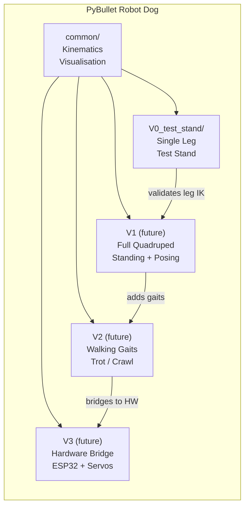
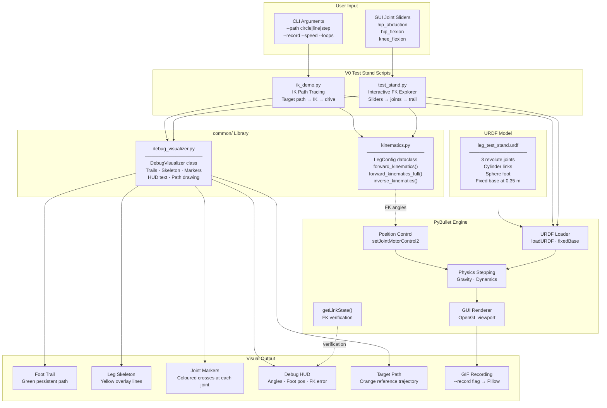
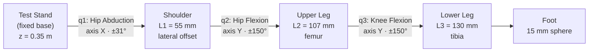
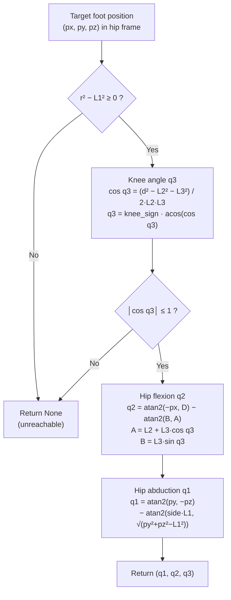
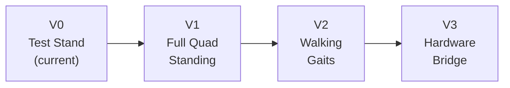

# PyBullet Robot Dog

Simulating a [SpotMicro](https://github.com/michaelkubina/SpotMicroESP32)-inspired quadruped robot in [PyBullet](https://pybullet.org/), starting with a single-leg test stand for kinematics validation and building toward a full walking robot.

**Current focus: V0 — single leg on a test stand**, verifying forward and inverse kinematics with interactive joint control and path tracing in simulation.

The physical counterpart uses an ESP32, hobby servos, and an aluminum-extrusion test stand — the simulation lets us validate kinematics and gait trajectories before touching hardware.

---

## Architecture

### High-Level Overview

Each project version lives in its own folder and shares a common kinematics and visualisation library. Versions build on each other: V0 validates the leg, V1 assembles four legs, V2 makes them walk, and V3 bridges to real hardware.



### Detailed V0 Component Architecture



### Leg Kinematic Chain



### IK Solver Flow



---

## Leg Dimensions (SpotMicro-inspired)

| Segment | Symbol | Length | Description |
|---------|--------|--------|-------------|
| Shoulder offset | L1 | 55 mm | Lateral offset from hip abduction axis to hip flexion axis |
| Upper leg (femur) | L2 | 107 mm | Hip flexion joint to knee joint |
| Lower leg (tibia) | L3 | 130 mm | Knee joint to foot |
| **Total vertical reach** | L2+L3 | **237 mm** | Maximum downward extent when leg is straight |

### Coordinate System

```
      Z (up)
      │
      │       (test stand platform at z = 0.35 m)
      ╰──────→ X (forward)
     ╱
    Y (left)

    ┌──────────┐
    │TEST STAND│  ← fixed base, gray platform
    └────┬─────┘
         │
    q1: Hip Abduction  (rotates around X axis, ±31°)
         │
    ╔════╧════╗
    ║SHOULDER ║  ← L1 = 55 mm lateral offset (blue cylinder)
    ╚════╤════╝
         │
    q2: Hip Flexion  (rotates around Y axis, ±150°)
         │
    ┌────┴────┐
    │UPPER LEG│  ← L2 = 107 mm downward (red cylinder)
    └────┬────┘
         │
    q3: Knee Flexion  (rotates around Y axis, ±150°)
         │
    ┌────┴────┐
    │LOWER LEG│  ← L3 = 130 mm downward (dark blue cylinder)
    └────┬────┘
         │
       (FOOT)   ← 15 mm sphere (green)
```

At zero angles the foot hangs straight down at **(0, −0.055, −0.237)** relative to the hip (right leg).

---

## Project Structure

```
pybullet-robot-dog/
├── README.md                            # This file (docs, roadmap, troubleshooting)
├── requirements.txt                     # pybullet, numpy, Pillow
├── .gitignore
├── .gitattributes                       # LF enforcement for cross-platform consistency
├── recordings/                          # GIF recordings (gitignored except .gitkeep)
│   └── .gitkeep
├── scripts/
│   ├── check_v0_env.sh                  # Diagnose Python + numpy + pybullet (+ g++ hint)
│   ├── run_test_stand.sh                # Run test_stand.py (-u, picks conda if available)
│   └── run_ik_demo.sh                   # Run ik_demo.py (-u, same Python selection)
├── common/                              # Shared library across all versions
│   ├── __init__.py
│   ├── kinematics.py                    # FK / IK solver for 3-DOF SpotMicro leg
│   └── debug_visualizer.py             # PyBullet debug drawing: trails, skeleton, HUD
└── V0_test_stand/                       # V0: single leg on a fixed test stand
    ├── __init__.py
    ├── urdf/
    │   └── leg_test_stand.urdf         # Cylinder + sphere URDF, no meshes
    ├── test_stand.py                    # Interactive joint sliders + FK visualisation
    └── ik_demo.py                       # IK path tracing (circle, line, step)
```

### Why versioned folders?

Each version represents a fundamentally different simulation stage (single leg → quad body → gaits → hardware). Keeping them in separate folders:

- avoids breaking earlier experiments when iterating on later ones
- makes it easy to run any version independently
- keeps each version self-contained and easy to reason about

Shared math and visualisation live in `common/` so there is no duplication of the core kinematics.

---

## Quick Start

### Prerequisites

- **Python 3.10+** (3.8+ may work but type hints use `X | None` syntax)
- A display that supports OpenGL (PyBullet GUI). WSL2 users may need an X server (VcXsrv, WSLg) or run on the DCV remote desktop from the [aws-pybullet-environment](https://github.com/rubencg195/aws-pybullet-environment) project.

### Install

**Option A — venv + pip** (needs **`g++`** / `build-essential` on Linux when PyBullet builds from source):

```bash
cd pybullet-robot-dog
python3 -m venv .venv
source .venv/bin/activate
pip install -r requirements.txt
```

**Option B — Miniconda** (no compiler; conda-forge ships a **prebuilt** PyBullet binary — useful on minimal WSL/Ubuntu):

```bash
# One-time: install Miniconda to ~/miniconda3, then:
conda install -y -c conda-forge pybullet numpy pillow
# If conda asks you to accept Anaconda ToS for defaults:
#   conda tos accept --override-channels --channel https://repo.anaconda.com/pkgs/main
#   conda tos accept --override-channels --channel https://repo.anaconda.com/pkgs/r
```

Sanity check (picks system Python or `~/miniconda3` automatically):

```bash
bash scripts/check_v0_env.sh
```

### Run the Interactive Test Stand

```bash
# Uses Miniconda if it has pybullet, else system python3 — unbuffered logs (-u)
bash scripts/run_test_stand.sh

# Equivalent if your venv is already activated:
python -u V0_test_stand/test_stand.py
```

In the **Params** panel on the right, PyBullet shows **user debug sliders** (often called “sliders” or mistyped “slides”). They are not physics objects — they are UI controls that set each joint’s **target angle** for the position controller:

| Slider (label) | Joint | Range (degrees on the slider) |
|----------------|-------|-------------------------------|
| **Hip Abduction (deg)** | q1 — ab/adduction (lateral swing) | about ±31° |
| **Hip Flexion (deg)** | q2 — flexion in the sagittal plane | about ±150° |
| **Knee Flexion (deg)** | q3 — knee bend | about ±150° |
| **Clear Trail** | n/a | move the handle to clear the green foot trail |

Values are shown and edited in **degrees**; the script converts to radians for PyBullet. Default **camera** is a **front (coronal)** view from +X so you face the leg like the test-stand front view, not a side isometric. Use `--camera side` for the old yaw=45 view:

```bash
bash scripts/run_test_stand.sh --camera side
```

A **green trail** traces the foot path. The **yellow skeleton** overlay and **HUD text** update every frame showing joint angles, foot position in hip frame, total reach, and FK error (difference between our math and PyBullet's internal FK — should be near zero).

A **Clear Trail** button resets the green path.

### Run the IK Demo

```bash
bash scripts/run_ik_demo.sh

# Examples (extra args pass through):
bash scripts/run_ik_demo.sh --path line
bash scripts/run_ik_demo.sh --path step --loops 2 --record recordings/ik_step.gif
```

Or with an explicit interpreter:

```bash
# Circle trajectory (default) — vertical circle in XZ plane
python -u V0_test_stand/ik_demo.py

# Forward/backward line sweep
python -u V0_test_stand/ik_demo.py --path line

# Walking step cycle (flat stance + arched swing)
python -u V0_test_stand/ik_demo.py --path step

# Larger circle, slower
python -u V0_test_stand/ik_demo.py --path circle --radius 0.05 --speed 0.3

# Record to GIF (2 loops, then exit)
python -u V0_test_stand/ik_demo.py --path step --loops 2 --record recordings/ik_step.gif
```

Set **`PY_ROBOT_DOG=/path/to/python`** if both conda and system Python exist and you want to force one.

| Colour | Meaning |
|--------|---------|
| **Orange** path | Target trajectory (drawn once at start) |
| **Red** dot | Current target point (moves along path) |
| **Green** trail | Actual foot path computed by IK |
| **Yellow** lines | Leg skeleton overlay |

The HUD shows solved joint angles and tracking error in millimetres.

### Recording to GIF

Both scripts accept `--record <path>` to capture the PyBullet viewport via TinyRenderer:

```bash
python V0_test_stand/test_stand.py --record recordings/session.gif --fps 20 --width 1024 --height 768
```

Requires Pillow (`pip install Pillow`, already in `requirements.txt`).

---

## Kinematics Reference

### Forward Kinematics

Given joint angles \( (q_1, q_2, q_3) \) and link lengths \( (L_1, L_2, L_3) \), the foot position relative to the hip for a right leg (`side_sign = -1`):

```
x = −L₂ sin(q₂) − L₃ sin(q₂ + q₃)

D = L₂ cos(q₂) + L₃ cos(q₂ + q₃)     [sagittal-plane reach]

y = side · L₁ cos(q₁) + D sin(q₁)
z = side · L₁ sin(q₁) − D cos(q₁)
```

The `forward_kinematics_full()` variant also returns intermediate positions (hip, shoulder, knee) for drawing the skeleton.

### Inverse Kinematics

Given target `(px, py, pz)` in the hip frame:

1. **Knee (q3):** Law of cosines in the leg sagittal plane.
2. **Hip flexion (q2):** Two-argument arctangent decomposition.
3. **Hip abduction (q1):** Geometric projection in the YZ plane.

Returns `None` when the target is outside the reachable workspace (too far, too close to the abduction axis, or inside the shoulder-offset sphere).

See `common/kinematics.py` for the full implementation.

---

## Roadmap

**Status labels:** DONE · IN PROGRESS · NOT STARTED

### At a Glance

| Phase | Focus | Status |
|-------|-------|--------|
| **V0** | Single-leg test stand — FK/IK validation | IN PROGRESS |
| **V1** | Full quadruped body — standing and posing | NOT STARTED |
| **V2** | Walking gaits — trot, crawl, transitions | NOT STARTED |
| **V3** | Hardware bridge — ESP32 + servo control | NOT STARTED |



---

### V0 — Single Leg Test Stand (IN PROGRESS)

Simulate one SpotMicro leg fixed in the air on a test stand, validate FK/IK, and draw foot trajectories.

| # | Task | Status | Notes |
|---|------|--------|-------|
| 0.1 | Project structure (versioned folders + common lib) | DONE | `common/`, `V0_test_stand/`, `recordings/` |
| 0.2 | URDF model — cylinder-based 3-DOF leg on fixed stand | DONE | `leg_test_stand.urdf`, L1=55mm L2=107mm L3=130mm |
| 0.3 | Forward kinematics implementation | DONE | `common/kinematics.py`, verified against PyBullet |
| 0.4 | Inverse kinematics (geometric, closed-form) | DONE | Handles unreachable targets, configurable knee sign |
| 0.5 | Interactive test stand with GUI sliders | DONE | `test_stand.py`, foot trail, skeleton, HUD, FK error |
| 0.6 | IK demo with path tracing (circle, line, step) | DONE | `ik_demo.py`, target vs actual comparison |
| 0.7 | Debug visualiser (trails, markers, HUD) | DONE | `common/debug_visualizer.py` |
| 0.8 | GIF recording support | DONE | `--record` flag on both scripts |
| 0.9 | Documentation (README with architecture diagrams) | DONE | This file |
| 0.10 | Workspace visualisation — plot reachable volume | NOT STARTED | Sample many joint configs, plot foot positions |
| 0.11 | Joint velocity and torque limits in IK | NOT STARTED | Trajectory smoothing, jerk limits |
| 0.12 | Jacobian computation and singularity detection | NOT STARTED | Useful for later impedance control |

---

### V1 — Full Quadruped Body (NOT STARTED)

Assemble four legs on a SpotMicro body, control standing height and body orientation (roll, pitch, yaw).

| # | Task | Status |
|---|------|--------|
| 1.1 | Full-body URDF (4 legs + body box) | NOT STARTED |
| 1.2 | Body-to-leg transforms (FR, FL, RR, RL) | NOT STARTED |
| 1.3 | Body pose control (height, roll, pitch, yaw) | NOT STARTED |
| 1.4 | Foot placement solver (given body pose → all feet on ground) | NOT STARTED |
| 1.5 | Interactive body pose sliders | NOT STARTED |

---

### V2 — Walking Gaits (NOT STARTED)

Implement and switch between common quadruped gaits.

| # | Task | Status |
|---|------|--------|
| 2.1 | Gait scheduler (phase timing per leg) | NOT STARTED |
| 2.2 | Trot gait (diagonal pairs) | NOT STARTED |
| 2.3 | Crawl / creep gait (one leg at a time) | NOT STARTED |
| 2.4 | Walk gait (wave pattern) | NOT STARTED |
| 2.5 | Turning (differential step length) | NOT STARTED |
| 2.6 | Terrain adaptation (basic) | NOT STARTED |

---

### V3 — Hardware Bridge (NOT STARTED)

Bridge from simulation to the physical robot (ESP32 + servos).

| # | Task | Status |
|---|------|--------|
| 3.1 | Serial/WiFi protocol for joint commands | NOT STARTED |
| 3.2 | ESP32 firmware for servo PWM | NOT STARTED |
| 3.3 | Servo calibration tool (map angles → PWM) | NOT STARTED |
| 3.4 | Real-time control loop (sim → hardware sync) | NOT STARTED |
| 3.5 | IMU integration and feedback | NOT STARTED |

---

## Troubleshooting

This section doubles as a **project status log**: what is finished, what is blocking progress, and what to do next. Symptom-based fixes follow below.

### Why the V0 sim fails immediately (root cause)

Run this from the repo root for a structured report:

```bash
bash scripts/check_v0_env.sh
```

| Symptom | Root cause | Fix |
|---------|------------|-----|
| `ModuleNotFoundError: No module named 'numpy'` | Dependencies never installed (or wrong Python). | `python3 -m venv .venv && source .venv/bin/activate && pip install -r requirements.txt` |
| `ModuleNotFoundError: No module named 'pybullet'` | PyBullet not installed. Often **pip could not build it**. | Install a C++ toolchain, then reinstall (next row). |
| Pip ends with `error: command 'x86_64-linux-gnu-g++' failed: No such file or directory` | **No C++ compiler** — PyBullet’s Linux wheels are not always published for every Python version; pip falls back to **building from source**, which needs `g++`. | `sudo apt-get install -y build-essential python3-dev` then `pip install -r requirements.txt` again, **or** use **Miniconda** + `conda install -c conda-forge pybullet` (see Quick Start). |
| `Cannot connect to ... display` / `Error 11` / blank GUI | No OpenGL display (SSH, bad `DISPLAY`, WSL without WSLg). | Use WSLg, an X server, or a desktop machine; see [PyBullet display](#pybullet-cannot-open-display--opengl-errors) below. |

**Summary:** On a typical minimal Ubuntu/WSL setup, the **first real blocker** is almost always **missing `build-essential`** so **`pybullet` never installs**; the script then crashes on `import pybullet` or, if numpy was skipped, on `import numpy`.

### Done (so far)

| Area | Status |
|------|--------|
| **Repository** | Initial code on `main`; pushed to [github.com/rubencg195/pybullet-robot-dog](https://github.com/rubencg195/pybullet-robot-dog). |
| **Layout** | `common/` (shared FK/IK + debug drawing), `V0_test_stand/` (URDF + scripts), `recordings/`, `requirements.txt`. |
| **Model** | `V0_test_stand/urdf/leg_test_stand.urdf` — 3-DOF SpotMicro-style leg (cylinders/spheres), fixed test stand at 0.35 m. |
| **Math** | `common/kinematics.py` — `LegConfig`, forward kinematics, geometric inverse kinematics, hip-frame conventions documented in README. |
| **Viz** | `common/debug_visualizer.py` — trails, skeleton overlay, markers, HUD text, path polylines. |
| **`test_stand.py`** | GUI sliders for three joints, green foot trail, FK vs PyBullet `getLinkState` check, **verbose terminal logs** every 120 steps (`[INIT]`, `[STEP …]`, `[DONE]`). |
| **`ik_demo.py`** | Circle / line / step trajectories, IK-driven motion, optional GIF. |
| **Docs** | README with Mermaid architecture diagrams, roadmap (V0–V3), and this troubleshooting guide. |

### Blockers

| Blocker | Detail | Mitigation |
|---------|--------|------------|
| **PyBullet not installed (dev machine)** | On a minimal Ubuntu/WSL image, `pip install pybullet` may try to **build from source** and fail with `g++` missing (`command 'x86_64-linux-gnu-g++' failed`). There is not always a pre-built wheel for your Python/OS combo. | Install a toolchain, then install deps: `sudo apt-get install -y build-essential python3-dev python3-pip python3-venv`, then use a venv: `python3 -m venv .venv && source .venv/bin/activate && pip install -r requirements.txt`. |
| **No system `pip` / PEP 668** | Some distros ship Python without `pip` or block `pip install` on the system interpreter. | Use `python3 -m venv .venv` and `pip install` inside the venv, or bootstrap pip with [get-pip.py](https://bootstrap.pypa.io/get-pip.py) using `--user` only if you accept that path. |
| **GUI / display** | Headless agents, SSH without X11, or WSL without WSLg/X server cannot open `p.GUI`. | Use a real desktop, WSLg, VcXsrv/X410, or the [aws-pybullet-environment](https://github.com/rubencg195/aws-pybullet-environment) DCV desktop. For batch tests only, a future optional `p.DIRECT` mode could be added (not required for your interactive workflow). |
| **CI / automated GUI test** | There is no GitHub Actions (or similar) job that exercises the PyBullet window in this repo yet. | Run `test_stand.py` / `ik_demo.py` locally or on the GPU workstation; add CI later with `DIRECT` + smoke assertions if desired. |

### Next steps

1. **Unblock the environment** — Install `build-essential`, `python3-dev`, and create a venv; confirm `python -c "import pybullet"` succeeds.
2. **Run V0 interactively** — From repo root: `python V0_test_stand/test_stand.py` (watch GUI + terminal `[STEP …]` lines). Then try `python V0_test_stand/ik_demo.py --path circle`.
3. **Optional recordings** — `python V0_test_stand/test_stand.py --record recordings/session.gif` (requires Pillow).
4. **Roadmap follow-ups (V0)** — Workspace sampling / reachable volume plot; joint velocity limits in IK; Jacobian and singularity notes (see roadmap table in README).
5. **V1 prep** — Body URDF, four leg mounts, body pose → foot placement (when you are ready to leave the single-leg stand).

---

### PyBullet: "cannot open display" / OpenGL errors

PyBullet GUI needs an OpenGL-capable display. On **WSL2**, either:
- Use **WSLg** (Windows 11 ships it by default — verify with `echo $DISPLAY`)
- Install an X server like **VcXsrv** or **X410** and set `export DISPLAY=:0`
- Run on the [aws-pybullet-environment](https://github.com/rubencg195/aws-pybullet-environment) DCV remote desktop instead

If you only need headless simulation (no window), use `p.connect(p.DIRECT)` instead of `p.GUI`.

### ImportError: No module named 'pybullet'

```bash
pip install -r requirements.txt
```

If you use a virtual environment, make sure it is activated before running. If install fails while **building** PyBullet, see **Blockers** above (`build-essential` / `g++`).

### IK returns None for targets that look reachable

The geometric IK solver returns `None` when:
1. The target is **further** than L2 + L3 from the hip flexion axis
2. The target is **closer** than |L2 − L3| (elbow lock)
3. The target is **inside the shoulder-offset sphere** (distance from hip < L1)
4. The YZ distance from hip is less than L1 (too close to the abduction axis)

Check the target coordinates and verify they are in the **hip frame** (not world frame). The hip frame origin is at the hip abduction joint; the world frame includes the stand height offset (0.35 m in Z).

### FK error is not exactly zero

A small FK error (< 0.001 m) between our math and PyBullet's `getLinkState` is normal — PyBullet uses position control with finite gains and time stepping, so the joints need a few steps to converge. The error should settle below 0.0001 m within ~50 ms of holding steady angles.

### GIF recording is blank or shows the wrong view

The recording uses `p.ER_TINY_RENDERER` (CPU renderer) which may produce slightly different output than the GPU viewport. Camera angle is fixed to the initial `resetDebugVisualizerCamera` call. Adjust `--width` and `--height` to match your desired aspect ratio.

### Sliders don't respond / window freezes

PyBullet's GUI loop runs in the main thread. Make sure no other PyBullet connection is active. On some systems, running from an IDE debugger can interfere with the GUI event loop — try running directly from the terminal.

### "leg_test_stand.urdf not found"

The scripts resolve the URDF path relative to their own location. Run them from the repo root:

```bash
python V0_test_stand/test_stand.py
```

Not from inside the `V0_test_stand/` directory (though that should also work since we use `__file__` for path resolution).

---

## References

- [SpotMicro ESP32](https://github.com/michaelkubina/SpotMicroESP32) — open-source SpotMicro build with ESP32
- [SpotMicro AI](https://github.com/FlorianWilworeit/SpotMicroAI) — gait research and simulation
- [PyBullet Quickstart Guide](https://docs.google.com/document/d/10sXEhzFRSnvFcl3XxNGhnD4N2SedqwdAvK3dsihxVUA/edit)
- [MIT Mini Cheetah](https://github.com/mit-biomimetics/Cheetah-Software) — reference quadruped control
- [aws-pybullet-environment](https://github.com/rubencg195/aws-pybullet-environment) — GPU remote desktop for PyBullet (companion project)
