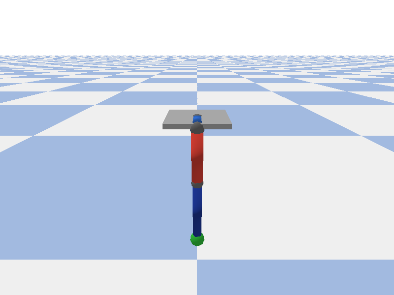
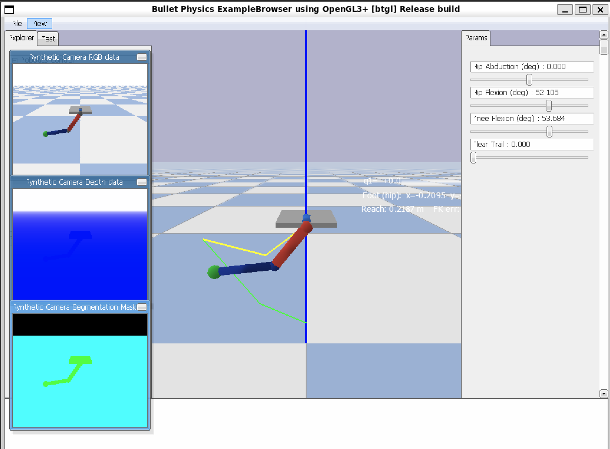
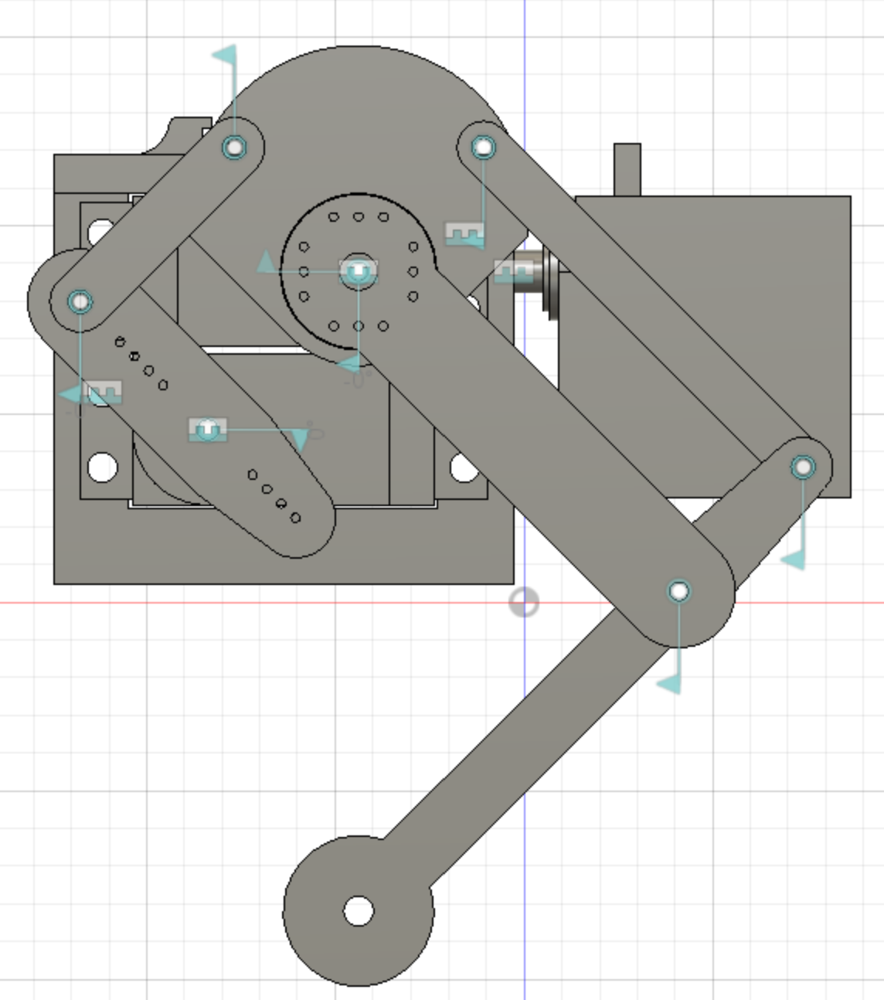
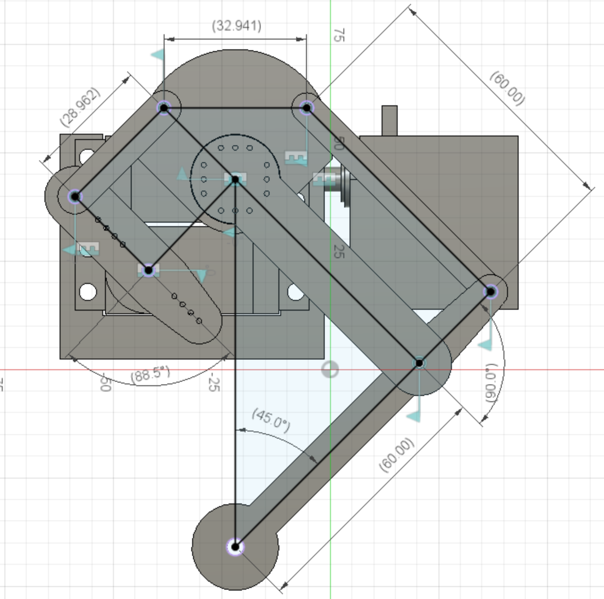
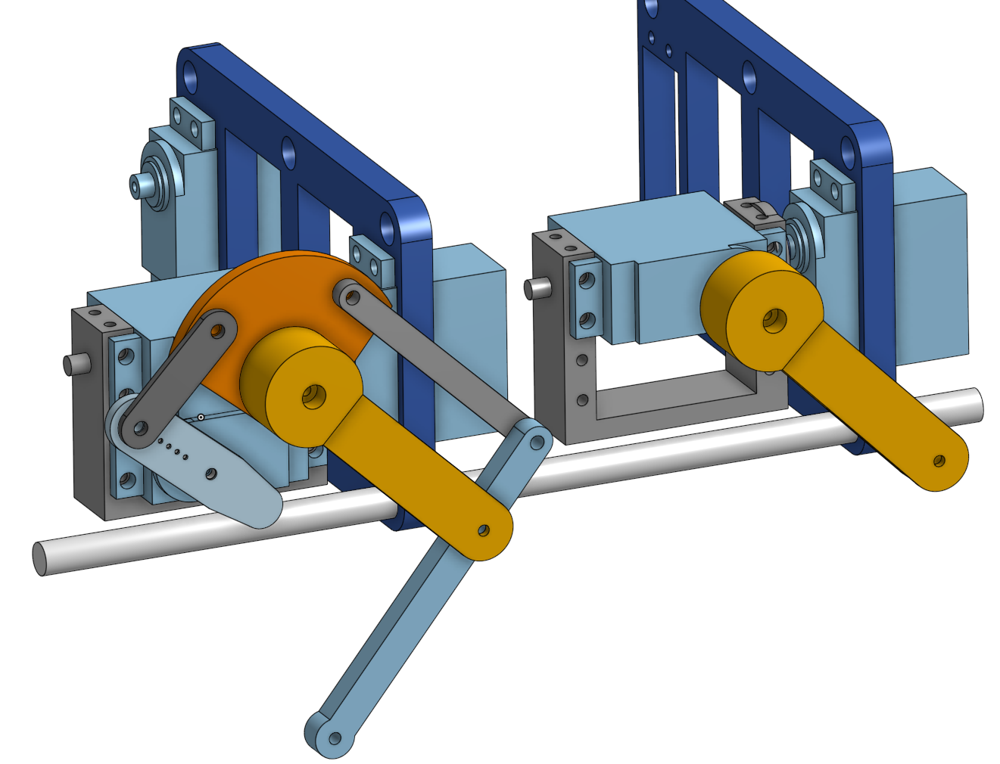
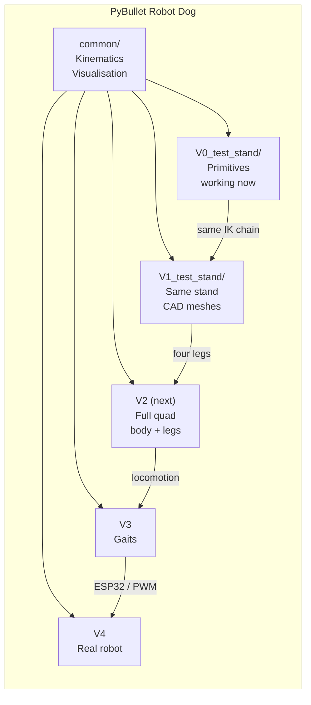
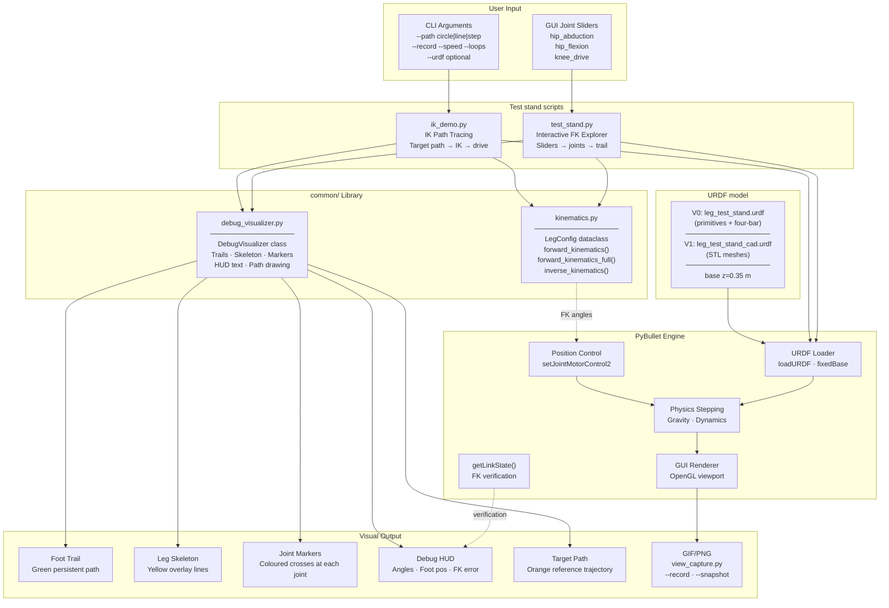
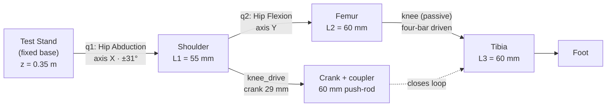
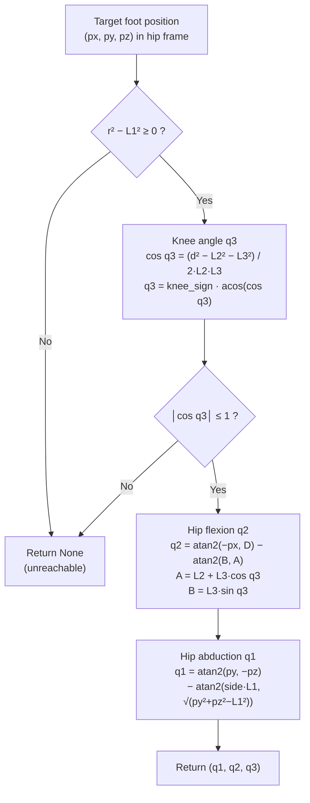
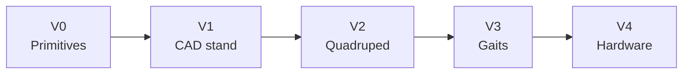

# PyBullet robot dog

This repo is a [SpotMicro](https://github.com/michaelkubina/SpotMicroESP32)-style quadruped in [PyBullet](https://pybullet.org/). **V0** is one leg on a test stand built from primitives (cylinders/spheres) with a **four-bar knee drive** matching the V1 CAD layout (60 mm femur/tibia, crank + coupler). **V1** is the *same* stand and joint layout with a mesh URDF: the first **Fusion 360** export is in `V1_test_stand/cad/stl/` (full MG996R assembly), with reference drawings under `images/V1_test_stand/`. PyBullet still needs five **per-link** STLs in `V1_test_stand/meshes/` aligned to `leg_test_stand_cad.urdf` before the V1 sim launchers run. Everything after that—full dog, gaits, hardware—is sketched as V2+.

There’s a real build on the bench too—ESP32, servos, aluminium extrusion—so the sim is where we mess with poses without stripping gears.

---

## Try this first

Coronal camera (you’re looking along +X, abduction swings toward you) plus a GIF saved next to the other samples:

```bash
bash scripts/run_test_stand.sh --record recordings/README_v0_test_stand.gif --fps 15 --camera coronal
```

When the window opens, use the **Params** sliders on the right—they’re in **degrees**. Move the leg around; the recorder samples the **same** view you see (including if you orbit with the mouse), using the same idea as [interactive_robot_arm.py](https://github.com/rubencg195/aws-pybullet-environment/blob/main/scripts/interactive_robot_arm.py) in the aws-pybullet-environment repo. Stop with **Ctrl+C** or by closing the window so Pillow can flush the GIF. You’ll need Pillow and a PyBullet that actually imports—if that’s painful on your machine, jump to [Getting it running](#getting-it-running).

Still PNG when you quit:

```bash
bash scripts/run_test_stand.sh --snapshot recordings/README_v0_test_stand.png --camera coronal
```

### What’s in `recordings/`

We only commit a few files from that folder (see `.gitignore`). Right now the README uses:

| GIF | PNG |
|:---:|:---:|
|  |  |

**Sister project** — browser-based [robot-dog-simulator](https://github.com/rubencg195/robot-dog-simulator) (Three.js; live at [robotdogsim.rubenchevez.com](https://robotdogsim.rubenchevez.com)):


### V1 CAD (Onshape export, v1.1)

Reference renders from the V1 test stand CAD live under `images/V1_test_stand/` (same idea as `references/spot-micro/images/` for the full [SpotMicro](https://www.thingiverse.com/thing:3445283) Thingiverse pack—reference art kept out of sim code). The design was migrated from Fusion 360 to **Onshape** in v1.1; the **shoulder servo holder** piece was added. Source meshes are the STLs in `V1_test_stand/cad/stl/`.

| Mechanism (front view, v1.0) | Dimensions (front view, v1.0) |
|:---:|:---:|
|  |  |

| Mechanism (perspective, v1.1) |
|:---:|
|  |

The mechanism is a four-bar style tibia drive (parallel links, MG996R housings, servo horn geometry) on a fixed test-stand base. **V0** already simulates this linkage with primitives; the CAD drawing is the mechanical source of truth. Compare femur/tibia/shoulder-offset lengths to `LegConfig` in `common/kinematics.py` (**L1** 55 mm, **L2** 60 mm, **L3** 60 mm). For the mesh URDF, export **five** STLs (`base_plate`, `shoulder_link`, `upper_leg`, `lower_leg`, `foot`) into `V1_test_stand/meshes/`—not all 16 Fusion bodies.

---

## What’s in the box

**V0** — `V0_test_stand/urdf/leg_test_stand.urdf` is the working leg: hip abduction + flexion, four-bar knee drive (`knee_drive` crank, passive knee + coupler, loop closed by a PyBullet constraint), V1 dimensions (60 mm links), base at 0.35 m. Sliders: `hip_abduction`, `hip_flexion`, `knee_drive`. `test_stand.py` and `ik_demo.py` live here.

**V1** — `V1_test_stand/urdf/leg_test_stand_cad.urdf` mirrors the same joints and limits, but every link uses `<mesh>` tags pointing at `V1_test_stand/meshes/*.stl`. The **Fusion export** (all bodies) is committed under `V1_test_stand/cad/stl/`; `images/V1_test_stand/` holds front-view mechanism and dimension drawings. The launchers (`V1_test_stand/test_stand.py` and `ik_demo.py`) still check for five **URDF** files (`base_plate`, `shoulder_link`, `upper_leg`, `lower_leg`, `foot`) and **quit with a checklist** if any are missing—derive those from the CAD pack when frames line up with V0. Under the hood they call the V0 scripts with `--urdf …/leg_test_stand_cad.urdf`. Use `bash scripts/run_test_stand_v1.sh` once the five meshes exist.

Shared pieces: `common/kinematics.py` (FK/IK, `LegConfig`), `common/debug_visualizer.py`, `common/view_capture.py`. Shell helpers: `check_v0_env.sh`, `run_test_stand.sh`, `run_ik_demo.sh`, plus `run_test_stand_v1.sh` / `run_ik_demo_v1.sh`.

---

## Architecture

Folders are versioned so a crude V0 leg and a future mesh V1 don’t fight each other, and later quadruped work stays separate. All of them can share `common/`.



### Sim data flow — V0 and V1 (same code path)

V1 is the V0 scripts with `--urdf` pointing at `leg_test_stand_cad.urdf` (or the thin wrappers under `V1_test_stand/`). Kinematics and debug draw are unchanged; only the loaded geometry differs.



### Leg chain



### IK pipeline (geometric)



---

## Leg numbers (V1 CAD, v1.0)

Dimensions from the Fusion dimensioned drawing; used in V0 primitives and `LegConfig`:

- **L1** 55 mm — shoulder offset (abduction axis to flexion axis)
- **L2** 60 mm — femur
- **L3** 60 mm — tibia
- **Ground link** 33 mm — hip pivot to knee-drive pivot (on shoulder)
- **Crank** 29 mm — knee servo arm
- **Coupler** 60 mm — push-rod (crank tip to knee)

Straight leg reaches **120 mm** below the hip flexion axis. FK/IK in `common/kinematics.py` still use the three-link model (L1–L3); the four-bar maps crank angle to knee angle in the URDF.

Axes: **X** forward, **Y** left, **Z** up. Base plate sits at **z = 0.35 m**. With all active joints at zero (right leg, `side_sign = -1`), the foot is near **(0, −0.055, −0.120)** in the hip frame (four-bar settles the passive knee).

```
      Z (up)
      │
      │       (platform at z = 0.35 m)
      ╰──────→ X (forward)
     ╱
    Y (left)
```

---

## Repo layout

```
pybullet-robot-dog/
├── README.md
├── requirements.txt
├── images/
│   └── V1_test_stand/          # Fusion reference renders (PNG)
├── recordings/                 # mostly ignored; README_* and PYB-SIM.png are tracked
├── references/
│   └── spot-micro/             # Thingiverse reference STLs + images (see README.txt)
├── scripts/
│   ├── check_v0_env.sh
│   ├── run_test_stand.sh
│   ├── run_ik_demo.sh
│   ├── run_test_stand_v1.sh
│   └── run_ik_demo_v1.sh
├── common/
│   ├── kinematics.py
│   ├── debug_visualizer.py
│   └── view_capture.py
├── V0_test_stand/
│   ├── urdf/leg_test_stand.urdf
│   ├── test_stand.py
│   └── ik_demo.py
└── V1_test_stand/
    ├── cad/stl/                # Fusion assembly export (16 bodies, v1.0)
    ├── meshes/                 # five URDF link STLs (when ready)
    ├── urdf/leg_test_stand_cad.urdf
    ├── test_stand.py           # wrapper → V0 + --urdf
    └── ik_demo.py
```

---

## Getting it running

You want Python 3.10+ (older might work; we use `X | None` in a few places) and something that can open an OpenGL window. On WSL that often means WSLg, VcXsrv, or a remote desktop from [aws-pybullet-environment](https://github.com/rubencg195/aws-pybullet-environment).

**venv + pip** — on many Linux installs PyBullet compiles from source, so you need a compiler:

```bash
cd pybullet-robot-dog
python3 -m venv .venv
source .venv/bin/activate
pip install -r requirements.txt
```

**Miniconda** — if `g++` isn’t there or pip keeps dying, conda-forge ships a binary:

```bash
conda install -y -c conda-forge pybullet numpy pillow
# if conda nags about ToS on defaults:
# conda tos accept --override-channels --channel https://repo.anaconda.com/pkgs/main
# conda tos accept --override-channels --channel https://repo.anaconda.com/pkgs/r
```

Smoke test:

```bash
bash scripts/check_v0_env.sh
```

### Test stand

```bash
bash scripts/run_test_stand.sh
# or, explicitly:
bash scripts/run_test_stand.sh --record recordings/README_v0_test_stand.gif --fps 15 --camera coronal
python -u V0_test_stand/test_stand.py   # if your venv is already active
```

The **Params** panel sliders are PyBullet “user parameters”—they’re UI, not part of the physics. They set joint **targets** in degrees (we clamp to the URDF). **Clear Trail** just nukes the green path.

Cameras: **`stand`** is the side/profile rig shot (default before we cared about naming); **`iso`** is the old 45° corner; **`coronal`** is the face-on +X view used in the gallery GIF.

Green = foot trace, yellow = skeleton overlay, HUD = angles and a quick FK check against `getLinkState`.

### IK demo

```bash
bash scripts/run_ik_demo.sh
bash scripts/run_ik_demo.sh --path line
bash scripts/run_ik_demo.sh --path step --loops 2 --record recordings/ik_step.gif
```

Orange = commanded path, red dot = current target, green = where the foot actually went, yellow sticks = leg.

If you have two Pythons fighting, force one: `export PY_ROBOT_DOG=/path/to/python`.

### V1 (CAD meshes)

Full Fusion parts are already in `V1_test_stand/cad/stl/`. For PyBullet, export or merge into the five names under `meshes/` (`base_plate`, `shoulder_link`, `upper_leg`, `lower_leg`, `foot`) with link frames matching V0—see the dimensioned PNG in `images/V1_test_stand/`.

When those five STLs are in place:

```bash
bash scripts/run_test_stand_v1.sh --camera coronal
bash scripts/run_test_stand_v1.sh --record recordings/v1_session.gif --fps 15 --camera coronal
```

Until then the launcher prints what’s missing and exits—stick with V0.

### Recording notes

`--record` and `--snapshot` pull from the **debug** camera matrices, so what you record is what you framed in the GUI. GIF cadence follows `--fps` on the wall clock, not one frame per physics step—same trick as the Kuka script linked above. Pillow is required.

---

## Kinematics (quick reference)

**FK** for a right leg (`side_sign = -1`), foot in hip frame:

```
x = −L₂ sin(q₂) − L₃ sin(q₂ + q₃)

D = L₂ cos(q₂) + L₃ cos(q₂ + q₃)

y = side · L₁ cos(q₁) + D sin(q₁)
z = side · L₁ sin(q₁) − D cos(q₁)
```

`forward_kinematics_full()` also returns hip / shoulder / knee points for drawing.

**IK** is geometric: knee from law of cosines, then hip flexion, then abduction. It hands back `None` if the point is past full extension, inside the shoulder sphere, or otherwise silly. Details are in `common/kinematics.py`.

---

## Roadmap



| Phase | What | Status |
|-------|------|--------|
| **V0** | Single leg, four-bar knee URDF (V1 dims), sliders, IK demo, GIF/PNG capture | in good shape |
| **V1** | Same test stand; Fusion v1.0 in `cad/stl/` + `images/V1_test_stand/`; mesh URDF needs five link STLs in `meshes/` | CAD in repo; URDF meshes pending |
| **V2** | Full body URDF, four legs, stand/sit poses, foot placement from body pose | not started |
| **V3** | Scheduled gaits—trot, crawl, turns, maybe rough terrain hooks | not started |
| **V4** | Talk to the real rig—ESP32, PWM calibration, later IMU if we need it | not started |

**V0 loose ends** (optional polish on the primitive leg):

| # | Task |
|---|------|
| 0.10 | Plot reachable workspace |
| 0.11 | Velocity / torque limits in IK |
| 0.12 | Jacobian / singularities |

**V1 before it’s “real”:** map `cad/stl/` bodies into the five URDF links with frames aligned to V0 (or edit the URDF after a CAD round-trip), replace placeholder inertias with measured values if sim fidelity matters, and consider simplified collision meshes if full-res STLs are heavy.

---

## Troubleshooting

### It dies on import

Run `bash scripts/check_v0_env.sh`. Typical failures:

- **`No module named numpy`** — install deps in an active venv: `pip install -r requirements.txt`.
- **`No module named pybullet`** — pip tried to compile Bullet and you don’t have `g++`. Install `build-essential` + `python3-dev`, or grab PyBullet from conda-forge (see above). The error `x86_64-linux-gnu-g++' failed` is exactly that.
- **Display / `Error 11`** — no GL context. Fix `DISPLAY`, use WSLg, or run on a machine with a real window.

On stripped-down Ubuntu/WSL, missing **build-essential** is the usual villain.

### IK returns `None`

Usually the target is out of workspace, too close to the hip line, or you mixed up hip frame vs world frame (remember the +0.35 m base height in Z).

### FK error not zero

Position control takes a moment to settle; a few mm at a step boundary is normal, then it should hug `getLinkState` once the motors catch up.

### GIF looks wrong

We still render captures with TinyRenderer; if it looks softer than the live GL view, bump `--width` / `--height` or orbit before you record.

### Sliders dead / UI stuck

One PyBullet connection at a time; if you’re debugging inside an IDE, try a plain terminal.

### URDF “not found”

Run from repo root (the scripts resolve paths from `__file__`, but it saves headaches).

### V1 exits immediately

The five **URDF** STLs in `V1_test_stand/meshes/` aren’t there yet (the full Fusion export in `cad/stl/` is separate). The error lists the missing names—derive them from the CAD pack or temporarily point `--urdf` at the V0 URDF if you’re only testing the wrapper.

### Where we’re stuck in general

- **No CI** that opens a real GUI—run locally or on the DCV box.
- **PEP 668** distros: use a venv, don’t fight the system Python.

---

## References

- **In-repo:** `references/spot-micro/` — original [Thingiverse SpotMicro](https://www.thingiverse.com/thing:3445283) STLs, photos, and `README.txt` (parts list, assembly videos). Not used directly by the sim; kept for comparison and future quadruped work.
- [robot-dog-simulator](https://github.com/rubencg195/robot-dog-simulator) — browser-based Three.js sister project ([live preview](https://robotdogsim.rubenchevez.com))
- [SpotMicro ESP32](https://github.com/michaelkubina/SpotMicroESP32)
- [SpotMicro AI](https://github.com/FlorianWilworeit/SpotMicroAI)
- [PyBullet quickstart](https://docs.google.com/document/d/10sXEhzFRSnvFcl3XxNGhnD4N2SedqwdAvK3dsihxVUA/edit)
- [MIT Mini Cheetah software](https://github.com/mit-biomimetics/Cheetah-Software)
- [aws-pybullet-environment](https://github.com/rubencg195/aws-pybullet-environment) — remote GPU desktop we’ve used for PyBullet before
