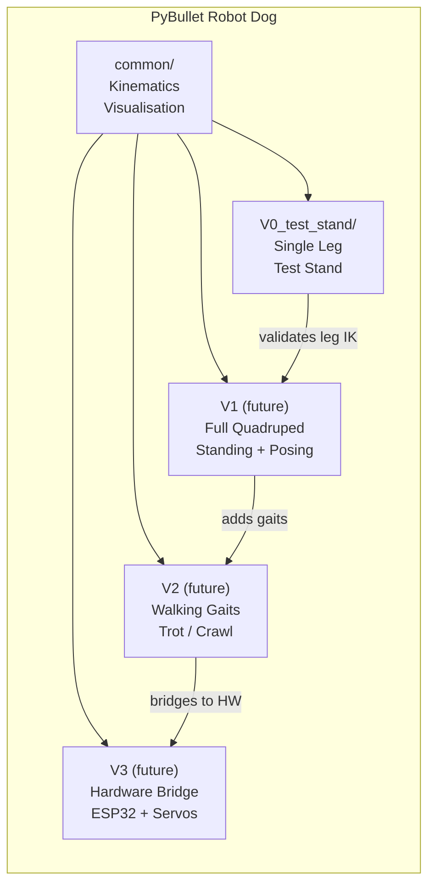
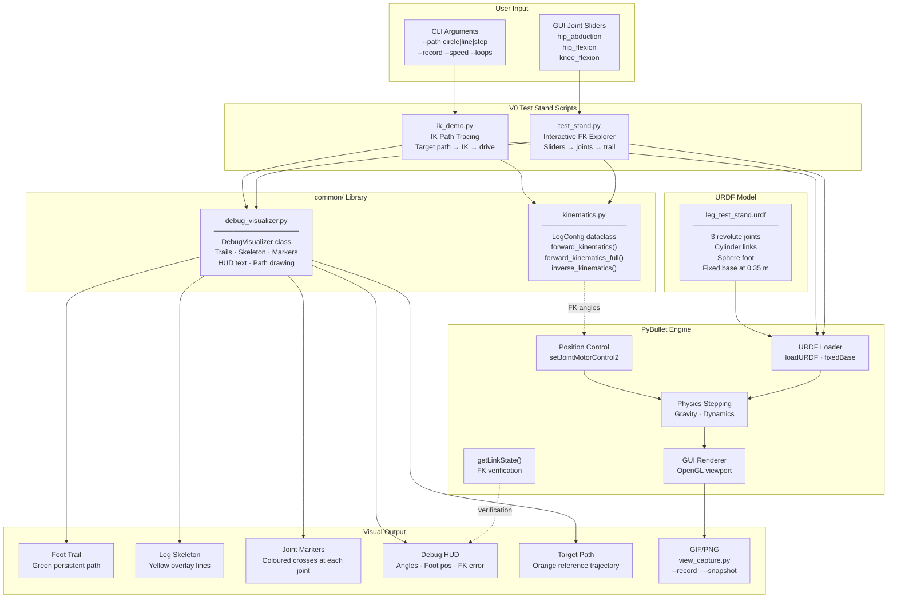
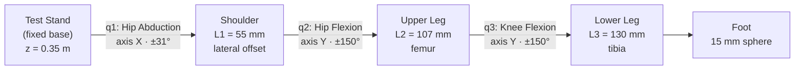
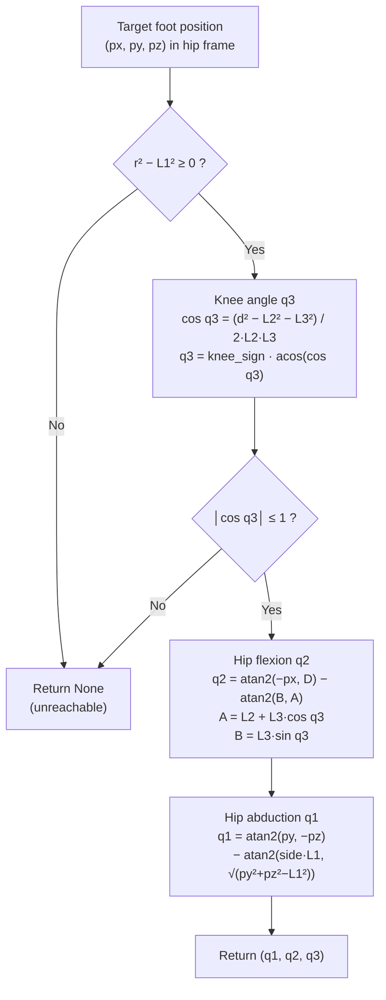
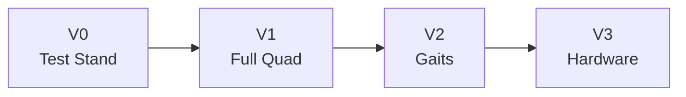

# PyBullet robot dog

This repo is a [SpotMicro](https://github.com/michaelkubina/SpotMicroESP32)-style quadruped in [PyBullet](https://pybullet.org/). Right now it’s just **one leg on a test stand** (V0): you can drag sliders, watch the foot trace a path, and sanity-check forward and inverse kinematics before we bolt four legs onto a body.

There’s a real build on the bench too—ESP32, servos, aluminium extrusion—so the sim is where we mess with poses without stripping gears.

---

## Try this first

Coronal camera (you’re looking along +X, abduction swings toward you) plus a GIF saved next to the other samples:

```bash
bash scripts/run_test_stand.sh --record recordings/README_v0_test_stand.gif --fps 15 --camera coronal
```

When the window opens, use the **Params** sliders on the right—they’re in **degrees**. Move the leg around; the recorder samples the **same** view you see (including if you orbit with the mouse), using the same idea as [interactive_robot_arm.py](https://github.com/rubencg195/aws-pybullet-environment/blob/main/scripts/interactive_robot_arm.py) in the aws-pybullet-environment repo. Stop with **Ctrl+C** or by closing the window so Pillow can flush the GIF. You’ll need Pillow and a PyBullet that actually imports—if that’s painful on your machine, jump to [Getting it running](#getting-it-running).

Still PNG when you quit:

```bash
bash scripts/run_test_stand.sh --snapshot recordings/README_v0_test_stand.png --camera coronal
```

### What’s in `recordings/`

We only commit a few files from that folder (see `.gitignore`). Right now the README uses:

| GIF | PNG |
|:---:|:---:|
|  |  |

---

## What’s in the box (V0)

The leg lives in `V0_test_stand/urdf/leg_test_stand.urdf`—three revolute joints, stubby cylinders, green foot sphere, base parked at 0.35 m. Kinematics live in `common/kinematics.py` (closed-form FK/IK in the hip frame; tweak lengths via `LegConfig`). `common/debug_visualizer.py` draws the green trail, yellow stick figure, and the floating text. `common/view_capture.py` is the tiny helper that grabs pixels from the **debug** camera so recordings match the GUI.

`test_stand.py` is the playground: degree sliders, URDF limit clamping, optional `--record` / `--snapshot`, three camera presets (`stand`, `iso`, `coronal`), and a line of telemetry every 120 sim steps. `ik_demo.py` drives circle / line / step paths with the same camera flags.

Shell glue is under `scripts/`: `check_v0_env.sh` tells you which Python actually has `pybullet`, and the `run_*.sh` wrappers prefer `~/miniconda3` or `PY_ROBOT_DOG` when the system Python is empty-handed.

---

## Architecture

Versions are split into folders so V0 doesn’t get stepped on when V1 adds a full body. Shared math stays in `common/`.



### V0 data flow (dense, but one picture)



### Leg chain



### IK pipeline (geometric)



---

## Leg numbers (SpotMicro-ish)

Rough proportions we’re using:

- **L1** 55 mm — shoulder offset (abduction axis to flexion axis)
- **L2** 107 mm — femur
- **L3** 130 mm — tibia  
Straight leg reaches **237 mm** below the hip line.

Axes: **X** forward, **Y** left, **Z** up. Base plate sits at **z = 0.35 m**. With all joint angles at zero (right leg, `side_sign = -1`), the foot sits at **(0, −0.055, −0.237)** in the hip frame.

```
      Z (up)
      │
      │       (platform at z = 0.35 m)
      ╰──────→ X (forward)
     ╱
    Y (left)
```

---

## Repo layout

```
pybullet-robot-dog/
├── README.md
├── requirements.txt
├── recordings/          # mostly ignored; README_* and PYB-SIM.png are tracked
├── scripts/
│   ├── check_v0_env.sh
│   ├── run_test_stand.sh
│   └── run_ik_demo.sh
├── common/
│   ├── kinematics.py
│   ├── debug_visualizer.py
│   └── view_capture.py
└── V0_test_stand/
    ├── urdf/leg_test_stand.urdf
    ├── test_stand.py
    └── ik_demo.py
```

---

## Getting it running

You want Python 3.10+ (older might work; we use `X | None` in a few places) and something that can open an OpenGL window. On WSL that often means WSLg, VcXsrv, or a remote desktop from [aws-pybullet-environment](https://github.com/rubencg195/aws-pybullet-environment).

**venv + pip** — on many Linux installs PyBullet compiles from source, so you need a compiler:

```bash
cd pybullet-robot-dog
python3 -m venv .venv
source .venv/bin/activate
pip install -r requirements.txt
```

**Miniconda** — if `g++` isn’t there or pip keeps dying, conda-forge ships a binary:

```bash
conda install -y -c conda-forge pybullet numpy pillow
# if conda nags about ToS on defaults:
# conda tos accept --override-channels --channel https://repo.anaconda.com/pkgs/main
# conda tos accept --override-channels --channel https://repo.anaconda.com/pkgs/r
```

Smoke test:

```bash
bash scripts/check_v0_env.sh
```

### Test stand

```bash
bash scripts/run_test_stand.sh
# or, explicitly:
bash scripts/run_test_stand.sh --record recordings/README_v0_test_stand.gif --fps 15 --camera coronal
python -u V0_test_stand/test_stand.py   # if your venv is already active
```

The **Params** panel sliders are PyBullet “user parameters”—they’re UI, not part of the physics. They set joint **targets** in degrees (we clamp to the URDF). **Clear Trail** just nukes the green path.

Cameras: **`stand`** is the side/profile rig shot (default before we cared about naming); **`iso`** is the old 45° corner; **`coronal`** is the face-on +X view used in the gallery GIF.

Green = foot trace, yellow = skeleton overlay, HUD = angles and a quick FK check against `getLinkState`.

### IK demo

```bash
bash scripts/run_ik_demo.sh
bash scripts/run_ik_demo.sh --path line
bash scripts/run_ik_demo.sh --path step --loops 2 --record recordings/ik_step.gif
```

Orange = commanded path, red dot = current target, green = where the foot actually went, yellow sticks = leg.

If you have two Pythons fighting, force one: `export PY_ROBOT_DOG=/path/to/python`.

### Recording notes

`--record` and `--snapshot` pull from the **debug** camera matrices, so what you record is what you framed in the GUI. GIF cadence follows `--fps` on the wall clock, not one frame per physics step—same trick as the Kuka script linked above. Pillow is required.

---

## Kinematics (quick reference)

**FK** for a right leg (`side_sign = -1`), foot in hip frame:

```
x = −L₂ sin(q₂) − L₃ sin(q₂ + q₃)

D = L₂ cos(q₂) + L₃ cos(q₂ + q₃)

y = side · L₁ cos(q₁) + D sin(q₁)
z = side · L₁ sin(q₁) − D cos(q₁)
```

`forward_kinematics_full()` also returns hip / shoulder / knee points for drawing.

**IK** is geometric: knee from law of cosines, then hip flexion, then abduction. It hands back `None` if the point is past full extension, inside the shoulder sphere, or otherwise silly. Details are in `common/kinematics.py`.

---

## Roadmap

Rough plan:



| Phase | Focus | Status |
|-------|-------|--------|
| V0 | Single leg, FK/IK, captures | mostly done |
| V1 | Four legs + body posing | not started |
| V2 | Trot / crawl / transitions | not started |
| V3 | ESP32 / PWM bridge | not started |

**V0 checklist** — done items are boring on purpose; the tail is where the fun is:

| # | Task | Status |
|---|------|--------|
| 0.1–0.4 | Layout, URDF, FK, IK | done |
| 0.5–0.7 | `test_stand`, `ik_demo`, debug draw | done |
| 0.8–0.9 | `view_capture`, README gallery, coronal record command | done |
| 0.10 | Plot reachable workspace | todo |
| 0.11 | Velocity / torque limits in IK | todo |
| 0.12 | Jacobian / singularities | todo |

V1–V3 are sketched (body URDF, gait scheduler, serial bridge)—see the tables in git history if you want the full punch-list; we’ll grow them when we actually start those phases.

---

## Troubleshooting

### It dies on import

Run `bash scripts/check_v0_env.sh`. Typical failures:

- **`No module named numpy`** — install deps in an active venv: `pip install -r requirements.txt`.
- **`No module named pybullet`** — pip tried to compile Bullet and you don’t have `g++`. Install `build-essential` + `python3-dev`, or grab PyBullet from conda-forge (see above). The error `x86_64-linux-gnu-g++' failed` is exactly that.
- **Display / `Error 11`** — no GL context. Fix `DISPLAY`, use WSLg, or run on a machine with a real window.

On stripped-down Ubuntu/WSL, missing **build-essential** is the usual villain.

### IK returns `None`

Usually the target is out of workspace, too close to the hip line, or you mixed up hip frame vs world frame (remember the +0.35 m base height in Z).

### FK error not zero

Position control takes a moment to settle; a few mm at a step boundary is normal, then it should hug `getLinkState` once the motors catch up.

### GIF looks wrong

We still render captures with TinyRenderer; if it looks softer than the live GL view, bump `--width` / `--height` or orbit before you record.

### Sliders dead / UI stuck

One PyBullet connection at a time; if you’re debugging inside an IDE, try a plain terminal.

### URDF “not found”

Run from repo root (the scripts resolve paths from `__file__`, but it saves headaches).

### Where we’re stuck in general

- **No CI** that opens a real GUI—run locally or on the DCV box.
- **PEP 668** distros: use a venv, don’t fight the system Python.

---

## References

- [SpotMicro ESP32](https://github.com/michaelkubina/SpotMicroESP32)
- [SpotMicro AI](https://github.com/FlorianWilworeit/SpotMicroAI)
- [PyBullet quickstart](https://docs.google.com/document/d/10sXEhzFRSnvFcl3XxNGhnD4N2SedqwdAvK3dsihxVUA/edit)
- [MIT Mini Cheetah software](https://github.com/mit-biomimetics/Cheetah-Software)
- [aws-pybullet-environment](https://github.com/rubencg195/aws-pybullet-environment) — remote GPU desktop we’ve used for PyBullet before
